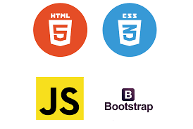
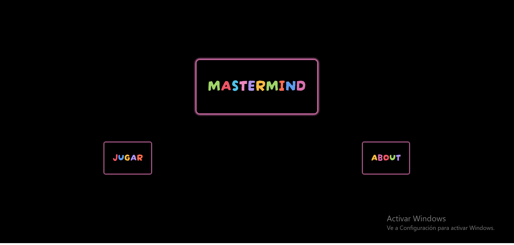
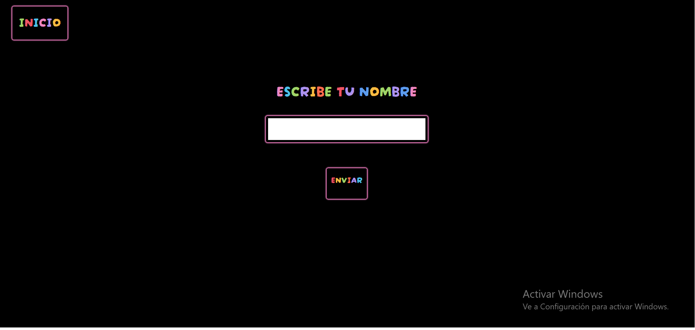
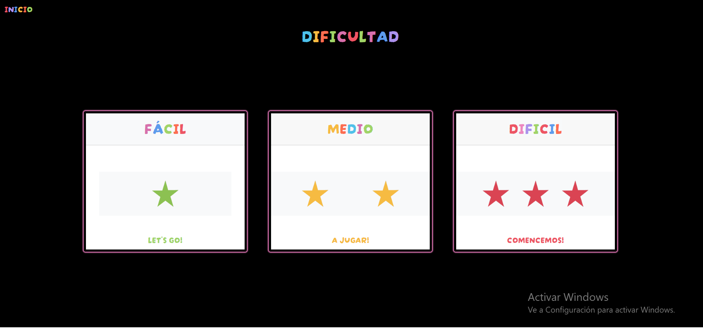
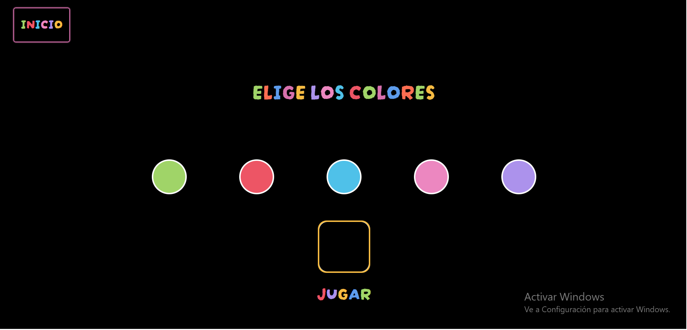
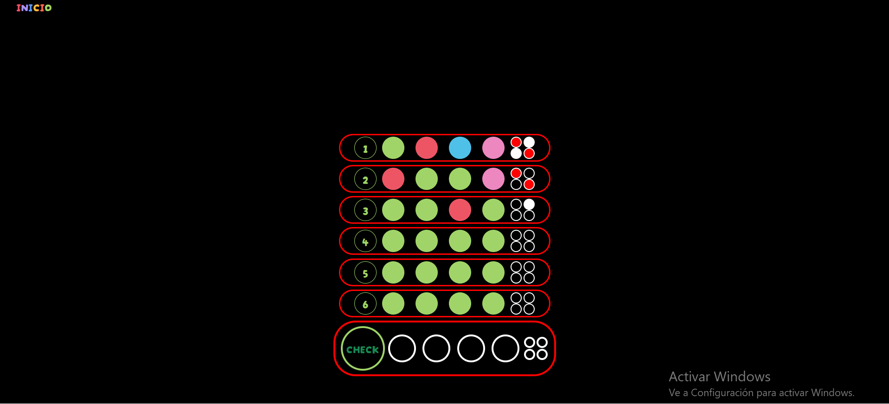

<h1>MASTERMIND

---

<h3>1. Explicacion del proyecto 

<h3>2. Tecnologías utilizadas

<h3>3. Resultado final

<h3>4. Créditos

---

<h3>1. EXPLICACIÓN DEL PROYECTO</h3>

Este proyecto ha sido el tercer proyecto de mi formacion académica como fullstack developer. 

He creado el juego MASTERMIND, es un juego de lógica en el cual tienes que adivinar en base a unos colores elegidos una cambinación secreta generada por el propio juego. 

Según la dificultad que escoja el usuario el número de colores y el numero de intentos varía. En la dificultad fácil el jugador tendrá que adivinar una combinación de 4 colores en 10 intentos, en la dificultad intermedia tendrá que adivinar una cambinacion de 4 colores con 5 colores disponibles y 8 intentos, y en el nivel dificil tendrá que adivinar una combinacion de 4 colores con 6 colores disponibles y 6 intentos. 

Dentro del juego prácticamente todas las pantallas son dinámicas, la página de elección de colores se ajusta a la dificultad, así como la generación de filas del tablero y el mensaje final. 

---

<h3>2. TECNOLOGÍAS UTILIZADAS </h3>

---

<h3>3. RESULTADO FINAL </h3>

    1. Página index 

    2. Pagina nombre

    3.Selector dificultad 

  

    4. Color Picker 

    5. Tablero 

---

<h3>4. CRÉDITOS</h3>

Gracias a todos mis compañeros por la ayuda que me han dado cuando la he necesitado.

---

<h3>5. SIGUIENTES PASOS </h3>

El proyeco siempre va a estar abierto para propuestas de mejora, si tienes alguna no dudes en escribirme al correo: cabezacarsialejandro@gmail.com

 

 

 

 

 

 

 

 

 

 

 

 

 

 

 

 

 

 

 

 

 

 

 

 

 

 

 

 

<3 <3 Si has llegado hasta aquí <3 <3

